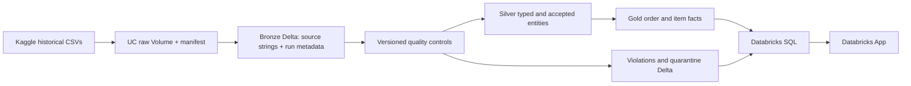

# Architecture

The deployed POC runs entirely inside Databricks: KaggleHub stages the historical files, an immutable Unity Catalog Volume retains originals and a SHA-256 manifest, a native PySpark job writes append-only Bronze/Silver/Gold Delta snapshots and Quality history, a SQL warehouse serves curated facts, and a Streamlit Databricks App presents operations and trust together.

`pipelines/databricks_job.py` is the native Serverless Jobs entrypoint; `pipelines/serverless_notebook.py` provides an existing-notebook path. Neither requires a classic cluster ID. The current live POC was executed through the Serverless notebook path; the bundle Job resource remains available but has not been exercised as the live deployment method. The configurable known catalog is `workspace`. Shared source/rule/metric catalogs live under `src/olist`. Native quality predicates operate on Spark DataFrames without collecting source records; only small rule summaries reach the driver. Native transformations read named governed Bronze/Silver tables, enabling UC lineage where supported. Table and column comments plus logical owner/classification properties are applied in UC. Access grants and actual owners are administrative policy, not fictional role assignments.

`src/olist/pipeline.py` and Parquet `LocalStore` form a **development harness**, with matching quality and transformation semantics. They require no external database or API service and do not replace Delta deployment. Tests compare native Spark and local metrics on isolated fixtures.

Each run has a UUID. Business history tables carry `pipeline_run_id`; Quality history carries `run_id`. A single `quality.published_run` Delta pointer selects the currently published snapshot after every Gold write and governance operation succeeds. The local harness uses an atomic `current.json` rename. Blocked/failed attempts leave the previous pointer unchanged. Query history tables with an explicit run ID; never sum across snapshots. Incomplete run writes are inspectable but never selected as current facts. Job concurrency is one; this is not a distributed publication protocol.

Source date windows are cumulative, exclusive upper bounds on purchase time: January cutoff then February cutoff simulates chronological incremental processing. Prior accepted rows are rebuilt per snapshot, not appended again to the active fact. Reference datasets remain full, valid future children are deferred, true source orphans and malformed purchase dates remain visible to DQ. This is a simple historical POC simulation, not CDC. Children use their order's purchase cohort, not their own later payment/review arrival; no historical point-in-time claim is made.

Geolocation canonicalization reduces source observations to one ZIP prefix using median coordinates and deterministic modal city/state. The retained source observation count exposes the reduction. Child items/payments are independently aggregated before joining order facts. Reviews select latest answer timestamp with review-ID tie-breaker. No many-to-many raw geolocation joins occur.

Application data access supports local curated Parquet and Databricks SQL Statement Execution. Databricks Apps supplies OAuth for the app service principal; the warehouse is an attached app resource. The app never reads raw CSVs. The shared metric module owns formulas; UI pages filter, request domain calculations, and present results. SQL result truncation raises an error instead of showing partial totals. Full POC facts are bounded by a 200,000-row query limit and the SQL inline byte limit; large deployments must move filtered metrics/rankings to SQL aggregates or paginated APIs.

Lakeflow is optional; this POC uses a Databricks-native PySpark/Delta implementation for transparent rule history and portability. The currently deployed phase does not yet contain the planned GenAI/RAG/agentic extension; it is the governed data and dashboard foundation for that next phase. No external infrastructure is required for the current phase.
